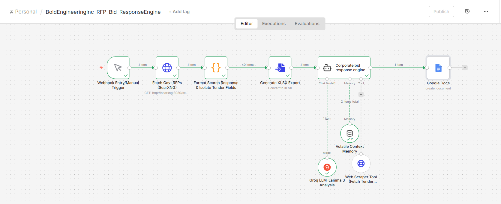

# n8n-canadabuys-rfp-pipeline
An automated, parallel n8n pipeline that tracks bulk CanadaBuys RFP data and generates targeted procurement proposals using Llama 3.3 70B.
# Autonomous RFP Triage & Parallel AI Proposal Generation Pipeline

An enterprise-grade, asynchronous backend automation pipeline built in n8n that ingests public sector procurement feeds (CanadaBuys), executes parallel data pipelines, and leverages high-tier Generative AI to instantly draft compliant, structured bid proposals.

---

## 🛠️ Technical Workflow Architecture

The core architecture uses a single-trigger, parallel-branch execution layout to separate bulk data indexing operations from deep generative processing streams:

1. **Bulk Processing Branch (Asynchronous Logging):** Processes incoming raw data arrays up to 40 records simultaneously. This branch maps, formats, and structures comprehensive tracking data directly into a finalized `.xlsx` spreadsheet export for business intelligence tracking.
2. **AI Generation Branch (Deterministic Processing):** Isolates the top-priority row via custom inline JavaScript. This branch isolates the payload down to exactly 1 execution item, preventing LLM loop token waste and avoiding API throttling.

---

## ⚙️ Core Engineering Achievements

* **Parallel Data Splitting:** Designed a branching data pipeline that simultaneously runs a bulk operation (40-row spreadsheet compilation) and an isolated single operation (AI prompt generation) from a single source payload.
* **Deterministic Token Budgeting:** Implemented a JavaScript filtering layer to trim deep string inputs down to character thresholds. This explicitly keeps payloads cleanly within free-tier API rate limits (TPM thresholds) while retaining critical RFP parameters.
* **Context-Optimized Negative Prompting:** Integrated a strict negative-constraint prompt layout using `Llama-3.3-70b-versatile` via Groq. This approach entirely eliminates generic bracketed template fallbacks (like `[Government Agency]`) and dynamically maps official public sector entities like **Public Services and Procurement Canada (PSPC)**.
* **Cloud Document Integration:** Configured authenticated OAuth tokens to automatically format, map, and append streaming output data into a native Google Docs repository.

---

## 💻 Tech Stack & Frameworks

* **Automation Orchestration:** n8n (Node-Based Workflow Engine)
* **Data Layer Processing:** JavaScript (Node.js runtime environment)
* **Generative Core:** Llama 3.3 70B via Groq API Engine
* **Target Data Targets:** Google Drive API & Google Docs Workspace Integration
* **Data Formats Used:** JSON, XLSX, Plain Text Formatting

---

## 🚀 How to Review and Deploy This Project

To review the exact node logic, connection mappings, and data structures locally:

1. Download the file `BoldEngineeringInc_RFP_Bid_ResponseEngine.json` from the repository file list above.
2. Open your local or cloud-hosted **n8n Canvas**.
3. Click the menu button in the top right, select **Import from File**, and upload the `.json` file.
4. Configure your own API environment credentials for Groq and Google Workspace to run live test variables.
